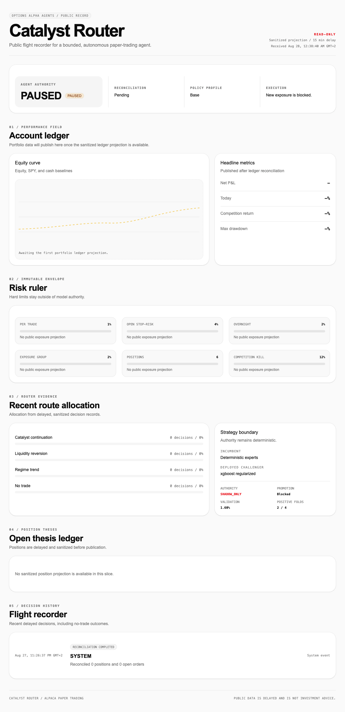
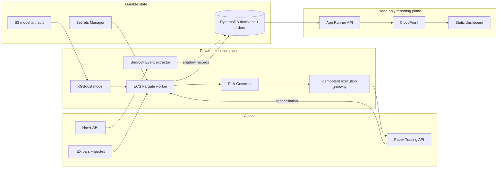

# Catalyst Router

<div align="center">

**An autonomous, risk-bounded AI agent for Alpaca paper trading**

`XGBoost signals` · `Dynamic equity universe` · `Long/short equities` · `Immutable decisions`

</div>

Catalyst Router turns completed market bars into directional trades, but keeps capital authority
outside the model. A checksummed XGBoost classifier proposes long, short, or abstain; deterministic
code validates market data, sizes risk, claims executable decisions exactly once, and submits
server-protected equity brackets to Alpaca. Sanitized predictions, vetoes, routes, and executions feed a
delayed public flight recorder.



## Trading Model

The order-authorized model is a regularized **XGBoost binary classifier** trained on point-in-time
Alpaca IEX bars for a fixed panel of 12 liquid US equities and ETFs. At runtime it predicts the
probability of a positive four-hour move across a daily dynamic universe, an explicit distribution
shift accepted by [`ADR-0016`](docs/adr/0016-use-a-dynamic-universe-for-long-directional-options.md).

| Model contract | Implemented behavior |
| --- | --- |
| Candidate | `xgboost_regularized` |
| Artifact | Immutable run `20260828T175917Z`, loaded from S3 and verified by SHA-256 |
| Input | Completed 15-minute regular-session bars, delayed one minute for corrections |
| Horizon | 16 bars / 4 hours |
| Features | Lagged returns, range, VWAP distance, volume ratio, realized volatility, SPY context, relative return, cross-sectional rank, range location, and time of day |
| Runtime universe | Up to 20 liquid, option-enabled symbols ranked from the 100 most active stocks, 50 gainers, and 50 losers; SPY retained as market context |
| Output | Probability mapped to `LONG`, `SHORT`, or `ABSTAIN` |
| Runtime gate | Long at `p >= 0.52`; short at `p <= 0.48`; abstain otherwise |
| Cadence | Poll every 15 seconds; score the latest completed vector per symbol and claim each symbol/bar/model tuple idempotently |
| Portfolio | Rank candidates by confidence, enter at most one per cycle, hold at most six symbols |

### From prediction to trade

```text
completed IEX bars
        │
        ▼
point-in-time feature vector
        │
        ▼
XGBoost probability ──► LONG / SHORT / ABSTAIN
        │
        ▼
fresh quote + spread + market-hours gates
        │
        ▼
deterministic Risk Governor
        │
        ▼
idempotent Alpaca equity entry
   long/short bracket + broker-hosted exits
```

The separation is deliberate: the model chooses direction and confidence, never quantity. The Risk
Governor can reduce or veto every proposal, and the execution gateway alone can construct an Alpaca
order.

### Risk envelope

| Control | Enforced limit |
| --- | ---: |
| Entry notional | 10% of account equity |
| Equity risk per trade | Entry-to-stop loss capped at 1% of equity; reduced to 0.5% after a 2% daily loss |
| Concurrent positions | 6 |
| Total open stop-risk | 5% of equity |
| One correlated exposure group | 5% of equity |
| Freshness and liquidity | Quote at most 5 seconds old; spread at most 15 bps |
| Daily circuit breaker | Halt and flatten at a 4% daily loss |
| Competition circuit breaker | Kill and flatten at a 12% peak-to-current drawdown |
| Session boundary | No entry in the final 15 minutes; flatten inside the final 10 minutes |

Positions are rejected when the account is blocked, the market is closed, reconciliation is stale,
data quality fails, or the account cannot support both the requested buying power and stop-risk.
Equity entries use server-hosted stop-loss and take-profit brackets. The worker verifies protection on
every poll and risk-halts if a held position loses either protective leg. Directional option execution
is disabled under [`ADR-0018`](docs/adr/0018-return-directional-execution-to-equities.md).

### P&L and validation evidence

Alpaca remains the source of truth for paper-account state. The public dashboard reports the equity
curve against cash, net P&L, competition return, daily return, observed drawdown, current risk usage,
and the public decisions that produced those results. Decision and portfolio records are sanitized
and delayed by 15 minutes; current agent status and challenger metadata are sanitized but immediate.
The reporting plane cannot control the agent.

Historical evidence for the authorized artifact uses four expanding chronological folds, purges
overlapping four-hour labels, and charges 12 bps round trip per selected position.

| Evidence | Return | Sharpe | Max drawdown | Trades |
| --- | ---: | ---: | ---: | ---: |
| Mean walk-forward validation | **+1.60%** | **0.61** | See fold results | 394 across 4 folds |
| Diagnostic holdout | **+8.38%** | **3.22** | **3.94%** | 76 |

Only two of four validation folds were positive, and the holdout was inspected during development.
These results are evidence, not a profitability guarantee; the model received explicit bounded
paper-trading authority despite not meeting its original promotion gate. The full protocol, fold
results, failed experiments, and limitations are documented in
[`docs/training/local-benchmark.md`](docs/training/local-benchmark.md) and
[`ADR-0013`](docs/adr/0013-authorize-the-model-for-paper-execution.md).

### Shadow AI research path

Alongside the live classifier, an AWS Bedrock model converts recent Alpaca News into a typed financial
Event: direction, magnitude, novelty, surprise, confidence, horizon, affected symbols, and invalidating
evidence. A deterministic router combines that record with price confirmation.

This path is intentionally `SHADOW_ONLY`. Bedrock cannot size positions, create orders, or affect the
order-authorized model. Malformed, stale, or unbounded output fails closed to `NO_TRADE`. This creates
forward evidence for a future event-aware model without risking competition capital on an unvalidated
LLM strategy.

## Alpaca Services

| Alpaca technology | How Catalyst Router uses it | Authority |
| --- | --- | --- |
| **Paper Trading API** | Reconciles account, clock, positions, and orders; submits equity brackets; closes and flattens exposure | Sole broker and P&L authority |
| **Market Data API** | Fetches IEX bars and quotes plus market screeners | Read-only market evidence |
| **News API** | Reads the latest symbol-scoped articles for Bedrock Event extraction | Shadow evidence only |
| **`alpaca-py` SDK** | Typed runtime adapter for trading, account state, historical bars, quotes, and news | Private worker only |
| **Alpaca CLI** | Paper-account diagnostics and judge-friendly dry-run demonstrations through `scripts/alpaca-paper` | Read-only; submit is allowed only with `--dry-run` |
| **Alpaca MCP server** | Not connected in this version; the runtime does not expose an LLM-controlled broker tool path | No trading authority |

The broker adapter is hard-pinned to `https://paper-api.alpaca.markets`. The CLI wrapper rejects
`--live`, rejects mutating commands, and keeps production execution inside the tested Python gateway.

## Usage

### Prerequisites

- Python 3.14+
- [`uv`](https://docs.astral.sh/uv/)
- Alpaca paper-trading credentials
- Node.js and npm only when running the dashboard
- Docker only for the DynamoDB integration test

### Install and verify

```bash
uv sync --group inference
uv run pytest
```

Provide paper credentials through `.env` or the process environment:

```dotenv
ALPACA_KEY=your-paper-key
ALPACA_SECRET=your-paper-secret
```

Confirm that the credentials resolve to a paper account and inspect sanitized state:

```bash
uv run catalyst-router check-alpaca
uv run catalyst-router reconcile
```

### Run the reporting experience

Start the read-only API:

```bash
uv run catalyst-router serve
```

In another terminal, start the dashboard:

```bash
npm --prefix dashboard ci
npm --prefix dashboard run dev
```

Open `http://localhost:3000`. Development uses the deployed CloudFront API configured in
`dashboard/.env.development` by default. To point it at the local API instead, start it with:

```bash
NEXT_PUBLIC_API_BASE_URL=http://127.0.0.1:8000 npm --prefix dashboard run dev
```

API documentation is available at
`http://127.0.0.1:8000/docs`; useful probes include:

```bash
curl http://127.0.0.1:8000/health
curl http://127.0.0.1:8000/ready
curl http://127.0.0.1:8000/api/public/status
```

`/ready` returns `503` until the current state-store epoch has been reconciled.

### Run the autonomous paper worker

Paper execution is disabled by default. A trading worker needs the authorized artifact in S3, shared
DynamoDB state, and explicit execution authority:

```dotenv
AWS_REGION=us-east-1
STATE_BACKEND=dynamodb
DYNAMODB_TABLE=catalyst-router-local
COMPETITION_ID=alpaca-hackathon-2026
RUNTIME_ROLE=worker

CHALLENGER_MANIFEST_URI=s3://your-bucket/models/20260828T175917Z/manifest.json
CHALLENGER_MANIFEST_SHA256=your-manifest-sha256
PAPER_EXECUTION_ENABLED=true
MODEL_EXECUTION_ENABLED=true
MODEL_OPTIONS_EXECUTION_ENABLED=false
MODEL_AUTHORITY=PAPER_LIVE
MODEL_DECISION_GATE=0.52
```

To also enable the shadow news path, configure `LLM_EVENTS_ENABLED=true`, `BEDROCK_MODEL_ID`, and
`BEDROCK_PROMPT_VERSION=event-v1`. It still has no order authority.

The default in-memory backend is process-local, so separate API, control, and worker processes do not
share it. Reconcile the DynamoDB store, grant authority, then start the worker:

```bash
uv run catalyst-router reconcile
uv run catalyst-router resume --reason "paper competition start"
uv run catalyst-router worker
```

`resume` refuses whenever Alpaca has an existing position or open order. Operator controls are
authenticated through local/AWS execution identity and are never exposed by the public API:

```bash
uv run catalyst-router pause --reason "operator review"
uv run catalyst-router flatten --reason "close all paper exposure"
uv run catalyst-router kill --reason "disable autonomous execution"
```

### Inspect with the Alpaca CLI

```bash
brew install alpacahq/tap/cli
scripts/alpaca-paper doctor
scripts/alpaca-paper account get --jq '{status, trading_blocked, options_trading_level}'
scripts/alpaca-paper order submit --symbol AAPL --side buy --qty 1 --type market --dry-run
```

### Train a challenger

```bash
make train-local
```

The current runner compares deterministic baselines, linear models, histogram boosting, and XGBoost
on five-minute bars with a 48-bar/four-hour horizon using purged chronological walk-forward
validation. It stores cached bars, checksummed Parquet datasets, manifests, and models under ignored
`.local/training/` paths. These `bar-features-v3` artifacts remain `SHADOW_ONLY`; this command does not
reproduce or replace the authorized 15-minute `bar-features-v2` artifact. See
[`docs/training/five-minute-pipeline.md`](docs/training/five-minute-pipeline.md).

Run the complete quality gate with `make check`.

## Architecture



### Execution lifecycle

1. **Reconcile.** Alpaca is authoritative for account, position, and order state. Startup creates a
   fenced execution epoch before any new exposure is allowed.
2. **Observe.** The worker polls Alpaca every 15 seconds, accepts bars one minute after completion, and
   builds the latest point-in-time vector for each runtime-universe symbol.
3. **Predict once.** A deterministic decision ID claims each latest symbol/bar/model tuple in DynamoDB
   so retries and restarts cannot execute it twice. Intermediate bars missed during downtime are not
   backfilled.
4. **Govern.** Fresh quotes, spread, market hours, buying power, stop-risk, group exposure, daily loss,
   and competition drawdown are evaluated outside model authority.
5. **Execute safely.** A UUID5 client order ID and SHA-256 request hash claim one Alpaca equity bracket.
   Ambiguous submissions are queried by client ID before the gateway changes local state.
6. **Report.** Immutable records feed a separate read-only API and delayed public dashboard. Public
   infrastructure has no Alpaca credentials or write permission to operational state.

### Repository map

| Path | Responsibility |
| --- | --- |
| `src/catalyst_router/challenger.py` | Artifact verification and XGBoost inference |
| `src/catalyst_router/training.py` | Feature construction, labels, walk-forward training |
| `src/catalyst_router/risk.py` | Deterministic sizing, limits, and vetoes |
| `src/catalyst_router/execution.py` | Signal ranking, order planning, idempotency, circuit breakers |
| `src/catalyst_router/adapters/` | Alpaca, Bedrock, DynamoDB, and in-memory adapters |
| `src/catalyst_router/reporting.py` | Sanitized public portfolio projections |
| `dashboard/` | Statically exported Next.js public flight recorder |
| `infra/environments/prod/` | OpenTofu for ECS, App Runner, DynamoDB, S3, CloudFront, IAM, and observability |
| `docs/adr/` | Versioned model, authority, risk, and infrastructure decisions |

The central design rule is simple: **AI proposes; deterministic code disposes; Alpaca reconciles.**
